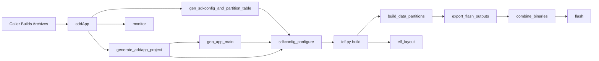

# `idf` Build Notes

This directory now has two main public entry points:

- `resolveBuildContext(...)` in `BuildContext.zig`
- `addApp(...)` in `App.zig`

The design is:

- the caller builds Zig/C artifacts first
- `BuildContext` resolves environment and target information once
- `addApp(...)` stages a temporary ESP-IDF project around the app entry module and any extra components
- ESP-IDF is only responsible for final configure/build/flash/monitor work

## `resolveBuildContext(...)`

`resolveBuildContext(...)` is the "early environment resolution" step.

It does not build the app. It only collects the information that every later build step needs.

### Inputs

`ResolveBuildContextOptions` currently contains:

- `build_config: *std.Build.Module`
- `app_root: []const u8 = "."`
- `build_dir: []const u8 = "build"`

Important:

- `build_config` is a Zig `Module`, not a raw file path.
- This means the caller can construct the module however it wants and inject imports through the normal Zig module graph.
- BSP is intentionally not part of `BuildContext`. The app archive should import BSP explicitly when the caller builds that archive.

### What It Does

`resolveBuildContext(...)` currently does these jobs:

1. Resolves the `esp` dependency and finds the public `idf` module.
2. Reads `build_config.board.chip` by compiling and running a tiny host-side probe against the provided `build_config` module.
3. Resolves the ESP-IDF checkout from `-Didf` or `IDF_PATH`.
4. Resolves the Zig target from the chip.
5. Resolves the ESP-IDF exported environment once via `tools/idf_env.py`.
6. Resolves the ESP toolchain sysroot for C archive compilation.
7. Captures the caller's `app_root` and `build_dir` so later staging steps do not have to re-derive them.

### Returned `BuildContext`

`BuildContext` currently returns:

| Field | What it is | What it is used for |
|---|---|---|
| `build_config_module` | The caller-provided typed config module | Used by host tools such as chip probing, sdkconfig generation, and data partition flashing |
| `binding_module` | The runtime Zig binding module from `esp` | Imported by user app archives that call ESP bindings |
| `esp_idf_module` | The public Zig `idf` module | Imported by build-time host tools and app-side modules |
| `esp_root` | The root of the `esp-zig` package | Used to locate helper tools like `generate_app_main.zig`, `generator.zig`, `idf_env.py`, etc. |
| `esp_idf` | The resolved ESP-IDF root path | Passed into `idf.py`, data-partition helpers, and sysroot resolution |
| `python_executable_path` | The resolved Python interpreter inside the ESP-IDF environment | Used to launch `idf.py`, `esptool`, monitor helpers, and other Python-based tools without relying on shell wrappers |
| `idf_env` | The exported ESP-IDF environment variables | Applied directly to subprocesses instead of sourcing `export.sh` through `bash` |
| `app_root` | The caller project's root directory | Used as the working directory for generated files and `idf.py` invocations |
| `build_dir` | The generated output directory for this app | Holds `sdkconfig.generated`, `partitions.generated.csv`, `idf_project`, and the actual IDF build directory |
| `chip` | The chip name from `build_config.board.chip` | Used to resolve the target and toolchain |
| `target` | The resolved Zig target for the app | Used when the caller compiles its Zig/C archives |
| `toolchain_sysroot` | Optional ESP toolchain sysroot information | Used when app-owned C archives need libc/system headers from the ESP toolchain |

### Practical Meaning

After `resolveBuildContext(...)`, the caller should have everything needed to build:

- Zig entry archives
- app-local C archives
- third-party C archives

and then pass those prebuilt artifacts into `addApp(...)`.

## `addApp(...)`

`addApp(...)` is the "stage an IDF project around a Zig entry module plus extra components" step.

The caller still prepares any extra source-backed or archive-backed `idf.Component`
inputs up front, but the app entry itself is passed in as a Zig module via
`opts.entry.module`.

### Inputs

The public input shape is:

- `app_name: []const u8`
- `opts: AddOptions`

Where:

- `opts.context` is the resolved `BuildContext`
- `opts.entry.module` is the app entry Zig module that will be staged into the generated IDF project
- `opts.entry.symbol` is the symbol that the generated `app_main.generated.c` should call
- `opts.components` is any extra `idf.Component` values that should be staged alongside the entry component

Runtime options are currently read from build options rather than `AddOptions`:

- `-Dport=<device>` controls flash/monitor serial port selection
- `-Dtimeout=<seconds>` controls monitor auto-exit timeout

### What It Stages

Under `build_dir/idf_project`, `addApp(...)` stages a minimal ESP-IDF project:

- `CMakeLists.txt`
- `main/CMakeLists.txt`
- `main/app_main.generated.c`
- `components/<component>/CMakeLists.txt`
- copied component source files under `components/<component>/...`
- copied component include directories under `components/<component>/...`
- `components/<component>/dummy.c` when a component only contributes archives or object files
- copied runtime shim C sources under `components/idf_shim/...`

This means:

- the entry module becomes one staged IDF component
- extra source-backed or archive-backed `idf.Component` values become their own staged IDF components
- `main` only contains the generated app entry shim
- runtime shim C helpers from `lib/component/*` are staged separately

## Returned `App`

`addApp(...)` returns:

- `gen_app_main`
- `gen_sdkconfig_and_partition_table`
- `sdkconfig_configure`
- `combine_binaries`
- `elf_layout`
- `flash`
- `monitor`

These are the public steps exposed today.

### Meaning Of Each Step

| Step | What it does |
|---|---|
| `gen_sdkconfig_and_partition_table` | Generates `sdkconfig.generated` and `partitions.generated.csv` from the typed `build_config` module |
| `gen_app_main` | Generates `main/app_main.generated.c` so IDF has a normal `app_main()` entry point |
| `sdkconfig_configure` | Runs `idf.py reconfigure` in the staged project |
| `combine_binaries` | Builds the staged app, exports flashable outputs to `build_dir/out/`, and merges them into `build_dir/out/combined.bin` |
| `elf_layout` | Runs `lib/idf/tools/elf_layout.zig` after a successful build and writes `build_dir/elf_layout.txt` |
| `flash` | Flashes the already-combined firmware image |
| `monitor` | Runs `idf.py monitor` without flashing first |

### Internal Steps Not Exposed Directly

`addApp(...)` also creates some internal steps that are not currently returned on `App`:

- the staged IDF project generator step
- the host-tool compilation steps used to run generators
- the internal `idf.py build` step for the staged application
- the internal data-partition image build step
- the flash-output export step

Those internal steps feed into the returned public steps, but the caller does not consume them directly.

## Step Relationships

The current dependency graph is:



More explicitly:

- `gen_app_main` depends on the staged IDF project generator
- `sdkconfig_configure` depends on `gen_sdkconfig_and_partition_table`, the staged IDF project generator, and `gen_app_main`
- the internal app build step depends on `configure`
- the internal data-partition image build step depends on the app build step
- the flash-output export step depends on the data-partition image build step
- `combine_binaries` depends on the flash-output export step
- `elf_layout` depends on the internal app build step
- `flash` depends on `combine_binaries`
- `monitor` has no flashing dependency and can run independently of `flash`

## What `combine_binaries` Really Means

The public `combine_binaries` handle is the point where all required flash images have
been exported and merged into one flashable binary.

But to get there, the full compile path is:

1. The caller compiles its own archives.
2. `gen_sdkconfig_and_partition_table` generates `sdkconfig.generated` and `partitions.generated.csv`.
3. the staged project generator writes the temporary IDF project into `build_dir/idf_project`.
4. `gen_app_main` generates `main/app_main.generated.c`.
5. `sdkconfig_configure` runs `idf.py reconfigure`.
6. the internal app build step runs `idf.py build`.
7. the internal data-partition build step generates one `.bin` per configured data partition into `build_dir`.
8. the build export step copies the flashable `.bin` outputs and app ELF into `build_dir/out/`.
9. `combine_binaries` merges those flashable outputs into `build_dir/out/combined.bin`.
10. `elf_layout` parses the finished ELF and writes `build_dir/elf_layout.txt`.

So when the caller does:

```zig
const build_step = b.step("build", "Build the ESP firmware");
build_step.dependOn(app.combine_binaries);
build_step.dependOn(app.elf_layout);
```

that one line pulls in the whole staging pipeline above.

## Current Scope

The current `App.steps` intentionally focuses on the main firmware workflow:

- generate config
- stage project
- configure
- build all required images
- optionally combine them into one flashable binary
- post-build ELF layout capture
- flash
- monitor

Other post-build analysis tasks such as golden-file update and layout checking are not yet part of `App.steps`.
